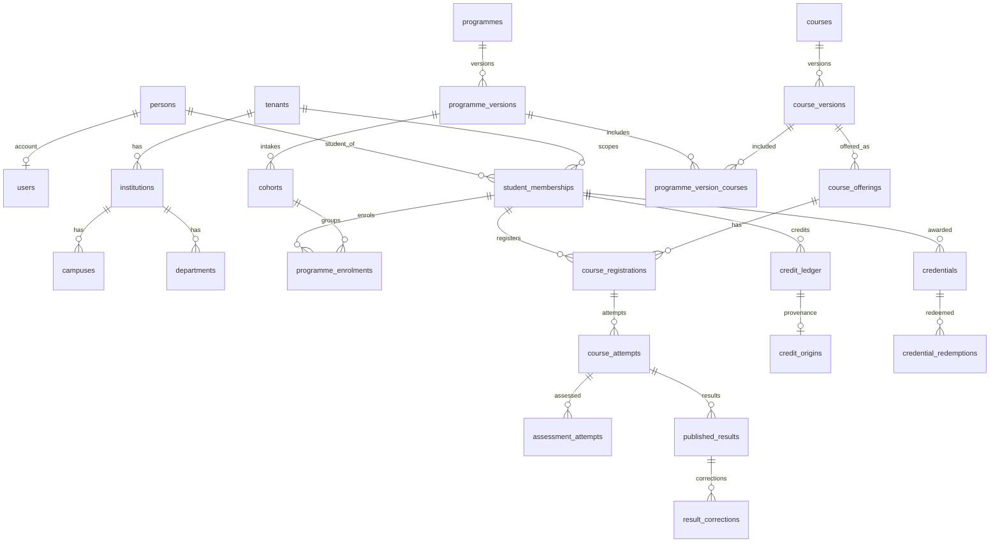

# RicozEdu Database Model � REVIEW DRAFT

**Status:** Awaiting review. Do not apply to production. Do not implement application code against this until approved.

**Domain interpreted as:** Core Identity & Tenancy + Academic Record (versioned programmes/courses, attempts, published results, credits, credentials).  
Placeholder `[DOMAIN]` was unspecified; this document covers the identity spine and academic history spine required by product principles. CRM, LMS content, fees, and ABC/NAD payload tables are **out of scope** here (documented as future FKs only).

**Review focus:** duplicate identities, historical correctness, tenant leakage, concurrency.

---

## 1. Entity relationship explanation

### Identity spine (no duplicate humans/students)

| Entity | Scope | Role |
|--------|-------|------|
| `persons` | **Global** (no `tenant_id`) | Canonical human. One row per natural person. |
| `users` | Global | Login account; FK ? `persons`. Not a student record. |
| `tenants` | Platform | Education group / school operator. |
| `institutions` | Tenant | Legal/academic institution under a tenant. |
| `campuses` | Tenant | Physical/virtual site under an institution. |
| `departments` | Tenant | Org unit under institution (optional scope). |
| `user_memberships` | Tenant | User ? tenant (optional institution narrow). |
| `student_memberships` | Tenant | **Authoritative thin student record** (not a giant table). Links `person_id` + `tenant_id` + `institution_id` + `student_number`. |

**Rule:** Admissions, LMS, fees, exams must reference `student_memberships.id` (and `person_id` only when human identity is required). Never create parallel �student� rows per subsystem.

### Academic catalog (versioned + effective-dated)

| Entity | Purpose |
|--------|---------|
| `programmes` | Stable programme identity (code/name umbrella). |
| `programme_versions` | Immutable version of rules (credits, exit, CBCS mapping). `effective_from` / `effective_to`. |
| `cohorts` | Intake group bound to a `programme_version_id`. |
| `courses` | Stable course identity. |
| `course_versions` | Syllabus/credit/OBE snapshot; effective-dated. |
| `programme_version_courses` | Which course versions belong to a programme version (with term/level). |

### Enrolment & attempts (mutable operational ? immutable outcomes)

| Entity | Purpose |
|--------|---------|
| `programme_enrolments` | Student on a cohort / programme version. |
| `course_registrations` | Student registered for a course offering. |
| `course_offerings` | Scheduled instance of a course version (term). |
| `course_attempts` | One attempt at a course (may span registrations). |
| `assessment_definitions` | Assessment within a course version/offering. |
| `assessment_attempts` | Student attempt at an assessment. |
| `grade_entries` | Working (unpublished) grades � mutable under permission. |
| `published_results` | **Immutable** official results once published. |
| `result_corrections` | Append-only corrections; never update `published_results` in place. |

### Credits & credentials

| Entity | Purpose |
|--------|---------|
| `credit_ledger` | Append-oriented credit facts (earned, transferred, waived). |
| `credit_origins` | Provenance of a credit fact (attempt, transfer, RPL). |
| `credit_transfers` | Inbound/outbound transfer cases + status. |
| `credentials` | Awarded credential records (immutable after issue). |
| `credential_redemptions` | ABC/NAD/external redemption/upload attempts (idempotent). |

### Platform support

| Entity | Purpose |
|--------|---------|
| `roles`, `permissions`, `role_bindings` | Authz |
| `audit_events` | Append-only security/compliance audit |
| `outbox_events` | Transactional outbox |
| `idempotency_keys` | API idempotency |
| `object_references` | Pointers to S3 keys only (no file bytes in DB) |
| `external_identifier_hashes` | APAAR/ABC/gov IDs as **keyed hashes** + optional encrypted vault ref � never plaintext |



### Concurrency model

- Tenant-owned mutable rows: `version INT NOT NULL DEFAULT 1` with optimistic concurrency (`UPDATE � WHERE version = $expected`).
- Immutable tables (`published_results`, `result_corrections`, `audit_events`, issued `credentials`): no `updated_at` mutation path; corrections = new rows.
- Academic rule changes = **new** `programme_versions` / `course_versions` with new effective dates; historical enrolments keep FK to the version used at the time.

---

## 2. SQL migration (review draft)

Apply as `ricoz_migrator`. Application connects as `ricoz_app` (no BYPASSRLS).

```sql
-- =============================================================================
-- 20260922000001_phase0_identity_and_academic_spine.up.sql
-- REVIEW DRAFT � not approved for apply until sign-off
-- =============================================================================

CREATE EXTENSION IF NOT EXISTS pgcrypto;

-- Roles (run once in bootstrap; passwords via secrets manager)
-- CREATE ROLE ricoz_migrator LOGIN;
-- CREATE ROLE ricoz_app LOGIN NOSUPERUSER NOBYPASSRLS;

CREATE SCHEMA IF NOT EXISTS ricoz;
SET search_path TO ricoz, public;

-- ---------- helpers ----------
CREATE OR REPLACE FUNCTION ricoz.set_updated_at()
RETURNS trigger LANGUAGE plpgsql AS $$
BEGIN
  NEW.updated_at := now();
  NEW.version := OLD.version + 1;
  RETURN NEW;
END;
$$;

CREATE OR REPLACE FUNCTION ricoz.tenant_id_from_setting()
RETURNS uuid LANGUAGE sql STABLE AS $$
  SELECT NULLIF(current_setting('app.tenant_id', true), '')::uuid;
$$;

-- =============================================================================
-- PLATFORM / TENANCY
-- =============================================================================

CREATE TABLE tenants (
  id          uuid PRIMARY KEY DEFAULT gen_random_uuid(),
  slug        text NOT NULL,
  name        text NOT NULL,
  status      text NOT NULL DEFAULT 'provisioning'
              CHECK (status IN ('provisioning','active','suspended','closed')),
  created_at  timestamptz NOT NULL DEFAULT now(),
  updated_at  timestamptz NOT NULL DEFAULT now(),
  created_by  uuid,
  updated_by  uuid,
  version     int NOT NULL DEFAULT 1,
  archived_at timestamptz,
  CONSTRAINT tenants_slug_uq UNIQUE (slug)
);

CREATE TABLE institutions (
  id          uuid PRIMARY KEY DEFAULT gen_random_uuid(),
  tenant_id   uuid NOT NULL REFERENCES tenants(id),
  code        text NOT NULL,
  name        text NOT NULL,
  status      text NOT NULL DEFAULT 'active'
              CHECK (status IN ('active','inactive','archived')),
  created_at  timestamptz NOT NULL DEFAULT now(),
  updated_at  timestamptz NOT NULL DEFAULT now(),
  created_by  uuid,
  updated_by  uuid,
  version     int NOT NULL DEFAULT 1,
  archived_at timestamptz,
  CONSTRAINT institutions_tenant_code_uq UNIQUE (tenant_id, code)
);

CREATE TABLE campuses (
  id              uuid PRIMARY KEY DEFAULT gen_random_uuid(),
  tenant_id       uuid NOT NULL REFERENCES tenants(id),
  institution_id  uuid NOT NULL REFERENCES institutions(id),
  code            text NOT NULL,
  name            text NOT NULL,
  status          text NOT NULL DEFAULT 'active'
                  CHECK (status IN ('active','inactive','archived')),
  created_at      timestamptz NOT NULL DEFAULT now(),
  updated_at      timestamptz NOT NULL DEFAULT now(),
  created_by      uuid,
  updated_by      uuid,
  version         int NOT NULL DEFAULT 1,
  archived_at     timestamptz,
  CONSTRAINT campuses_tenant_inst_code_uq UNIQUE (tenant_id, institution_id, code)
);

CREATE TABLE departments (
  id              uuid PRIMARY KEY DEFAULT gen_random_uuid(),
  tenant_id       uuid NOT NULL REFERENCES tenants(id),
  institution_id  uuid NOT NULL REFERENCES institutions(id),
  code            text NOT NULL,
  name            text NOT NULL,
  status          text NOT NULL DEFAULT 'active'
                  CHECK (status IN ('active','inactive','archived')),
  created_at      timestamptz NOT NULL DEFAULT now(),
  updated_at      timestamptz NOT NULL DEFAULT now(),
  created_by      uuid,
  updated_by      uuid,
  version         int NOT NULL DEFAULT 1,
  archived_at     timestamptz,
  CONSTRAINT departments_tenant_inst_code_uq UNIQUE (tenant_id, institution_id, code)
);

-- =============================================================================
-- PEOPLE / IAM (persons global � no tenant_id)
-- =============================================================================

CREATE TABLE persons (
  id              uuid PRIMARY KEY DEFAULT gen_random_uuid(),
  given_name      text NOT NULL,
  family_name     text NOT NULL,
  display_name    text NOT NULL,
  primary_email   citext, -- or text with lower() unique index
  date_of_birth   date,
  created_at      timestamptz NOT NULL DEFAULT now(),
  updated_at      timestamptz NOT NULL DEFAULT now(),
  created_by      uuid,
  updated_by      uuid,
  version         int NOT NULL DEFAULT 1,
  archived_at     timestamptz,
  CONSTRAINT persons_email_uq UNIQUE (primary_email)
);

-- If citext unavailable, use text + unique index on lower(primary_email)

CREATE TABLE users (
  id                     uuid PRIMARY KEY DEFAULT gen_random_uuid(),
  person_id              uuid NOT NULL REFERENCES persons(id),
  email                  text NOT NULL,
  password_hash          text NOT NULL,
  status                 text NOT NULL DEFAULT 'active'
                         CHECK (status IN ('invited','active','disabled')),
  authorization_version  int NOT NULL DEFAULT 1,
  created_at             timestamptz NOT NULL DEFAULT now(),
  updated_at             timestamptz NOT NULL DEFAULT now(),
  created_by             uuid,
  updated_by             uuid,
  version                int NOT NULL DEFAULT 1,
  archived_at            timestamptz,
  CONSTRAINT users_email_uq UNIQUE (email),
  CONSTRAINT users_person_uq UNIQUE (person_id)
);

CREATE TABLE refresh_tokens (
  id           uuid PRIMARY KEY DEFAULT gen_random_uuid(),
  user_id      uuid NOT NULL REFERENCES users(id),
  token_hash   bytea NOT NULL,
  family_id    uuid NOT NULL,
  expires_at   timestamptz NOT NULL,
  revoked_at   timestamptz,
  replaced_by  uuid REFERENCES refresh_tokens(id),
  created_at   timestamptz NOT NULL DEFAULT now()
);

CREATE TABLE permissions (
  id          uuid PRIMARY KEY DEFAULT gen_random_uuid(),
  code        text NOT NULL UNIQUE,
  description text NOT NULL
);

CREATE TABLE roles (
  id          uuid PRIMARY KEY DEFAULT gen_random_uuid(),
  tenant_id   uuid REFERENCES tenants(id), -- NULL = system template
  code        text NOT NULL,
  name        text NOT NULL,
  is_system   boolean NOT NULL DEFAULT false,
  created_at  timestamptz NOT NULL DEFAULT now(),
  updated_at  timestamptz NOT NULL DEFAULT now(),
  created_by  uuid,
  updated_by  uuid,
  version     int NOT NULL DEFAULT 1,
  archived_at timestamptz,
  CONSTRAINT roles_tenant_code_uq UNIQUE (tenant_id, code)
);

CREATE TABLE role_permissions (
  role_id       uuid NOT NULL REFERENCES roles(id) ON DELETE CASCADE,
  permission_id uuid NOT NULL REFERENCES permissions(id),
  PRIMARY KEY (role_id, permission_id)
);

CREATE TABLE user_memberships (
  id              uuid PRIMARY KEY DEFAULT gen_random_uuid(),
  tenant_id       uuid NOT NULL REFERENCES tenants(id),
  user_id         uuid NOT NULL REFERENCES users(id),
  institution_id  uuid REFERENCES institutions(id),
  status          text NOT NULL DEFAULT 'active'
                  CHECK (status IN ('active','suspended','revoked')),
  created_at      timestamptz NOT NULL DEFAULT now(),
  updated_at      timestamptz NOT NULL DEFAULT now(),
  created_by      uuid,
  updated_by      uuid,
  version         int NOT NULL DEFAULT 1,
  archived_at     timestamptz,
  CONSTRAINT user_memberships_tenant_user_uq UNIQUE (tenant_id, user_id)
);

CREATE TABLE role_bindings (
  id                  uuid PRIMARY KEY DEFAULT gen_random_uuid(),
  tenant_id           uuid NOT NULL REFERENCES tenants(id),
  user_membership_id  uuid NOT NULL REFERENCES user_memberships(id),
  role_id             uuid NOT NULL REFERENCES roles(id),
  institution_id      uuid REFERENCES institutions(id),
  created_at          timestamptz NOT NULL DEFAULT now(),
  created_by          uuid,
  CONSTRAINT role_bindings_uq UNIQUE (tenant_id, user_membership_id, role_id, institution_id)
);

-- Thin student record � NOT a giant student table
CREATE TABLE student_memberships (
  id              uuid PRIMARY KEY DEFAULT gen_random_uuid(),
  tenant_id       uuid NOT NULL REFERENCES tenants(id),
  institution_id  uuid NOT NULL REFERENCES institutions(id),
  campus_id       uuid REFERENCES campuses(id),
  person_id       uuid NOT NULL REFERENCES persons(id),
  student_number  text NOT NULL,
  status          text NOT NULL DEFAULT 'prospective'
                  CHECK (status IN ('prospective','active','inactive','graduated','withdrawn','suspended')),
  effective_from  date NOT NULL DEFAULT (CURRENT_DATE),
  effective_to    date,
  created_at      timestamptz NOT NULL DEFAULT now(),
  updated_at      timestamptz NOT NULL DEFAULT now(),
  created_by      uuid,
  updated_by      uuid,
  version         int NOT NULL DEFAULT 1,
  archived_at     timestamptz,
  CONSTRAINT student_memberships_number_uq UNIQUE (tenant_id, student_number),
  CONSTRAINT student_memberships_dates_chk CHECK (effective_to IS NULL OR effective_to >= effective_from)
);

-- At most one "open" membership per person per tenant
CREATE UNIQUE INDEX student_memberships_one_open_person
  ON student_memberships (tenant_id, person_id)
  WHERE status IN ('prospective','active','inactive','suspended') AND archived_at IS NULL;

CREATE TABLE student_status_history (
  id                     uuid PRIMARY KEY DEFAULT gen_random_uuid(),
  tenant_id              uuid NOT NULL REFERENCES tenants(id),
  student_membership_id  uuid NOT NULL REFERENCES student_memberships(id),
  from_status            text,
  to_status              text NOT NULL,
  reason                 text,
  changed_by_user_id     uuid REFERENCES users(id),
  changed_at             timestamptz NOT NULL DEFAULT now()
  -- immutable: no updated_at
);

-- Gov / national IDs: hash only + optional vault pointer (never plaintext)
CREATE TABLE external_identifier_hashes (
  id              uuid PRIMARY KEY DEFAULT gen_random_uuid(),
  tenant_id       uuid NOT NULL REFERENCES tenants(id),
  person_id       uuid NOT NULL REFERENCES persons(id),
  id_type         text NOT NULL CHECK (id_type IN ('APAAR','ABC','NAD','OTHER')),
  id_hash         bytea NOT NULL,           -- HMAC-SHA256 with tenant/pepper key
  vault_ref       text,                     -- external KMS/vault reference only
  created_at      timestamptz NOT NULL DEFAULT now(),
  created_by      uuid,
  CONSTRAINT external_identifier_hashes_uq UNIQUE (tenant_id, id_type, id_hash)
);

CREATE TABLE object_references (
  id              uuid PRIMARY KEY DEFAULT gen_random_uuid(),
  tenant_id       uuid NOT NULL REFERENCES tenants(id),
  bucket          text NOT NULL,
  object_key      text NOT NULL,
  content_type    text,
  byte_size       bigint CHECK (byte_size IS NULL OR byte_size >= 0),
  checksum_sha256 bytea,
  created_at      timestamptz NOT NULL DEFAULT now(),
  created_by      uuid,
  archived_at     timestamptz,
  CONSTRAINT object_references_uq UNIQUE (tenant_id, bucket, object_key)
);

-- =============================================================================
-- ACADEMIC CATALOG (versioned)
-- =============================================================================

CREATE TABLE programmes (
  id              uuid PRIMARY KEY DEFAULT gen_random_uuid(),
  tenant_id       uuid NOT NULL REFERENCES tenants(id),
  institution_id  uuid NOT NULL REFERENCES institutions(id),
  department_id   uuid REFERENCES departments(id),
  code            text NOT NULL,
  name            text NOT NULL,
  status          text NOT NULL DEFAULT 'active'
                  CHECK (status IN ('draft','active','retired')),
  created_at      timestamptz NOT NULL DEFAULT now(),
  updated_at      timestamptz NOT NULL DEFAULT now(),
  created_by      uuid,
  updated_by      uuid,
  version         int NOT NULL DEFAULT 1,
  archived_at     timestamptz,
  CONSTRAINT programmes_tenant_code_uq UNIQUE (tenant_id, code)
);

CREATE TABLE programme_versions (
  id                      uuid PRIMARY KEY DEFAULT gen_random_uuid(),
  tenant_id               uuid NOT NULL REFERENCES tenants(id),
  programme_id            uuid NOT NULL REFERENCES programmes(id),
  version_label           text NOT NULL,          -- e.g. '2026.1'
  effective_from          date NOT NULL,
  effective_to            date,
  total_credits           numeric(6,2) NOT NULL CHECK (total_credits > 0),
  rules_json              jsonb NOT NULL DEFAULT '{}'::jsonb, -- progression/exit (versioned snapshot)
  status                  text NOT NULL DEFAULT 'draft'
                          CHECK (status IN ('draft','published','superseded','retired')),
  published_at            timestamptz,
  created_at              timestamptz NOT NULL DEFAULT now(),
  updated_at              timestamptz NOT NULL DEFAULT now(),
  created_by              uuid,
  updated_by              uuid,
  version                 int NOT NULL DEFAULT 1,
  archived_at             timestamptz,
  CONSTRAINT programme_versions_label_uq UNIQUE (tenant_id, programme_id, version_label),
  CONSTRAINT programme_versions_dates_chk CHECK (effective_to IS NULL OR effective_to >= effective_from)
);

-- Once published, application MUST NOT update rules_json; supersede via new version.
-- Enforce with trigger or app rule + status check.

CREATE TABLE cohorts (
  id                    uuid PRIMARY KEY DEFAULT gen_random_uuid(),
  tenant_id             uuid NOT NULL REFERENCES tenants(id),
  institution_id        uuid NOT NULL REFERENCES institutions(id),
  programme_version_id  uuid NOT NULL REFERENCES programme_versions(id),
  code                  text NOT NULL,
  name                  text NOT NULL,
  intake_year           int NOT NULL CHECK (intake_year BETWEEN 1990 AND 2100),
  start_date            date NOT NULL,
  end_date              date,
  status                text NOT NULL DEFAULT 'planned'
                        CHECK (status IN ('planned','active','completed','cancelled')),
  created_at            timestamptz NOT NULL DEFAULT now(),
  updated_at            timestamptz NOT NULL DEFAULT now(),
  created_by            uuid,
  updated_by            uuid,
  version               int NOT NULL DEFAULT 1,
  archived_at           timestamptz,
  CONSTRAINT cohorts_tenant_code_uq UNIQUE (tenant_id, code),
  CONSTRAINT cohorts_dates_chk CHECK (end_date IS NULL OR end_date >= start_date)
);

CREATE TABLE courses (
  id              uuid PRIMARY KEY DEFAULT gen_random_uuid(),
  tenant_id       uuid NOT NULL REFERENCES tenants(id),
  institution_id  uuid NOT NULL REFERENCES institutions(id),
  code            text NOT NULL,
  title           text NOT NULL,
  status          text NOT NULL DEFAULT 'active'
                  CHECK (status IN ('draft','active','retired')),
  created_at      timestamptz NOT NULL DEFAULT now(),
  updated_at      timestamptz NOT NULL DEFAULT now(),
  created_by      uuid,
  updated_by      uuid,
  version         int NOT NULL DEFAULT 1,
  archived_at     timestamptz,
  CONSTRAINT courses_tenant_code_uq UNIQUE (tenant_id, code)
);

CREATE TABLE course_versions (
  id                uuid PRIMARY KEY DEFAULT gen_random_uuid(),
  tenant_id         uuid NOT NULL REFERENCES tenants(id),
  course_id         uuid NOT NULL REFERENCES courses(id),
  version_label     text NOT NULL,
  effective_from    date NOT NULL,
  effective_to      date,
  credit_value      numeric(6,2) NOT NULL CHECK (credit_value >= 0),
  syllabus_json     jsonb NOT NULL DEFAULT '{}'::jsonb,
  status            text NOT NULL DEFAULT 'draft'
                    CHECK (status IN ('draft','published','superseded','retired')),
  published_at      timestamptz,
  created_at        timestamptz NOT NULL DEFAULT now(),
  updated_at        timestamptz NOT NULL DEFAULT now(),
  created_by        uuid,
  updated_by        uuid,
  version           int NOT NULL DEFAULT 1,
  archived_at       timestamptz,
  CONSTRAINT course_versions_label_uq UNIQUE (tenant_id, course_id, version_label),
  CONSTRAINT course_versions_dates_chk CHECK (effective_to IS NULL OR effective_to >= effective_from)
);

CREATE TABLE programme_version_courses (
  id                    uuid PRIMARY KEY DEFAULT gen_random_uuid(),
  tenant_id             uuid NOT NULL REFERENCES tenants(id),
  programme_version_id  uuid NOT NULL REFERENCES programme_versions(id),
  course_version_id     uuid NOT NULL REFERENCES course_versions(id),
  is_core               boolean NOT NULL DEFAULT true,
  term_index            int CHECK (term_index IS NULL OR term_index >= 1),
  created_at            timestamptz NOT NULL DEFAULT now(),
  created_by            uuid,
  CONSTRAINT pvc_uq UNIQUE (tenant_id, programme_version_id, course_version_id)
);

CREATE TABLE academic_terms (
  id              uuid PRIMARY KEY DEFAULT gen_random_uuid(),
  tenant_id       uuid NOT NULL REFERENCES tenants(id),
  institution_id  uuid NOT NULL REFERENCES institutions(id),
  code            text NOT NULL,
  name            text NOT NULL,
  start_date      date NOT NULL,
  end_date        date NOT NULL,
  created_at      timestamptz NOT NULL DEFAULT now(),
  updated_at      timestamptz NOT NULL DEFAULT now(),
  created_by      uuid,
  updated_by      uuid,
  version         int NOT NULL DEFAULT 1,
  archived_at     timestamptz,
  CONSTRAINT academic_terms_uq UNIQUE (tenant_id, institution_id, code),
  CONSTRAINT academic_terms_dates_chk CHECK (end_date >= start_date)
);

CREATE TABLE course_offerings (
  id                 uuid PRIMARY KEY DEFAULT gen_random_uuid(),
  tenant_id          uuid NOT NULL REFERENCES tenants(id),
  institution_id     uuid NOT NULL REFERENCES institutions(id),
  campus_id          uuid REFERENCES campuses(id),
  course_version_id  uuid NOT NULL REFERENCES course_versions(id),
  academic_term_id   uuid NOT NULL REFERENCES academic_terms(id),
  section_code       text NOT NULL,
  capacity           int CHECK (capacity IS NULL OR capacity >= 0),
  status             text NOT NULL DEFAULT 'planned'
                     CHECK (status IN ('planned','open','closed','cancelled')),
  created_at         timestamptz NOT NULL DEFAULT now(),
  updated_at         timestamptz NOT NULL DEFAULT now(),
  created_by         uuid,
  updated_by         uuid,
  version            int NOT NULL DEFAULT 1,
  archived_at        timestamptz,
  CONSTRAINT course_offerings_uq UNIQUE (tenant_id, course_version_id, academic_term_id, section_code)
);

-- =============================================================================
-- ENROLMENT / ATTEMPTS / RESULTS
-- =============================================================================

CREATE TABLE programme_enrolments (
  id                     uuid PRIMARY KEY DEFAULT gen_random_uuid(),
  tenant_id              uuid NOT NULL REFERENCES tenants(id),
  student_membership_id  uuid NOT NULL REFERENCES student_memberships(id),
  cohort_id              uuid NOT NULL REFERENCES cohorts(id),
  programme_version_id   uuid NOT NULL REFERENCES programme_versions(id),
  status                 text NOT NULL DEFAULT 'active'
                         CHECK (status IN ('active','completed','withdrawn','deferred')),
  enrolled_at            date NOT NULL DEFAULT CURRENT_DATE,
  created_at             timestamptz NOT NULL DEFAULT now(),
  updated_at             timestamptz NOT NULL DEFAULT now(),
  created_by             uuid,
  updated_by             uuid,
  version                int NOT NULL DEFAULT 1,
  archived_at            timestamptz,
  CONSTRAINT programme_enrolments_student_cohort_uq UNIQUE (tenant_id, student_membership_id, cohort_id)
);

CREATE TABLE course_registrations (
  id                     uuid PRIMARY KEY DEFAULT gen_random_uuid(),
  tenant_id              uuid NOT NULL REFERENCES tenants(id),
  student_membership_id  uuid NOT NULL REFERENCES student_memberships(id),
  course_offering_id     uuid NOT NULL REFERENCES course_offerings(id),
  programme_enrolment_id uuid REFERENCES programme_enrolments(id),
  status                 text NOT NULL DEFAULT 'registered'
                         CHECK (status IN ('registered','waitlisted','dropped','completed')),
  registered_at          timestamptz NOT NULL DEFAULT now(),
  created_at             timestamptz NOT NULL DEFAULT now(),
  updated_at             timestamptz NOT NULL DEFAULT now(),
  created_by             uuid,
  updated_by             uuid,
  version                int NOT NULL DEFAULT 1,
  archived_at            timestamptz,
  CONSTRAINT course_registrations_uq UNIQUE (tenant_id, student_membership_id, course_offering_id)
);

CREATE TABLE course_attempts (
  id                     uuid PRIMARY KEY DEFAULT gen_random_uuid(),
  tenant_id              uuid NOT NULL REFERENCES tenants(id),
  student_membership_id  uuid NOT NULL REFERENCES student_memberships(id),
  course_version_id      uuid NOT NULL REFERENCES course_versions(id),
  course_registration_id uuid REFERENCES course_registrations(id),
  attempt_number         int NOT NULL CHECK (attempt_number >= 1),
  status                 text NOT NULL DEFAULT 'in_progress'
                         CHECK (status IN ('in_progress','completed','voided')),
  started_at             timestamptz NOT NULL DEFAULT now(),
  completed_at           timestamptz,
  created_at             timestamptz NOT NULL DEFAULT now(),
  updated_at             timestamptz NOT NULL DEFAULT now(),
  created_by             uuid,
  updated_by             uuid,
  version                int NOT NULL DEFAULT 1,
  archived_at            timestamptz,
  CONSTRAINT course_attempts_uq UNIQUE (tenant_id, student_membership_id, course_version_id, attempt_number)
);

CREATE TABLE assessment_definitions (
  id                 uuid PRIMARY KEY DEFAULT gen_random_uuid(),
  tenant_id          uuid NOT NULL REFERENCES tenants(id),
  course_version_id  uuid NOT NULL REFERENCES course_versions(id),
  course_offering_id uuid REFERENCES course_offerings(id),
  code               text NOT NULL,
  title              text NOT NULL,
  max_marks          numeric(8,2) NOT NULL CHECK (max_marks > 0),
  weight_percent     numeric(5,2) CHECK (weight_percent IS NULL OR (weight_percent >= 0 AND weight_percent <= 100)),
  created_at         timestamptz NOT NULL DEFAULT now(),
  updated_at         timestamptz NOT NULL DEFAULT now(),
  created_by         uuid,
  updated_by         uuid,
  version            int NOT NULL DEFAULT 1,
  archived_at        timestamptz,
  CONSTRAINT assessment_definitions_uq UNIQUE (tenant_id, course_version_id, code)
);

CREATE TABLE assessment_attempts (
  id                        uuid PRIMARY KEY DEFAULT gen_random_uuid(),
  tenant_id                 uuid NOT NULL REFERENCES tenants(id),
  student_membership_id     uuid NOT NULL REFERENCES student_memberships(id),
  assessment_definition_id  uuid NOT NULL REFERENCES assessment_definitions(id),
  course_attempt_id         uuid NOT NULL REFERENCES course_attempts(id),
  attempt_number            int NOT NULL CHECK (attempt_number >= 1),
  status                    text NOT NULL DEFAULT 'submitted'
                            CHECK (status IN ('draft','submitted','graded','voided')),
  raw_score                 numeric(8,2),
  submitted_at              timestamptz,
  created_at                timestamptz NOT NULL DEFAULT now(),
  updated_at                timestamptz NOT NULL DEFAULT now(),
  created_by                uuid,
  updated_by                uuid,
  version                   int NOT NULL DEFAULT 1,
  archived_at               timestamptz,
  CONSTRAINT assessment_attempts_uq UNIQUE (tenant_id, assessment_definition_id, student_membership_id, attempt_number)
);

-- Working gradebook (mutable until publish)
CREATE TABLE grade_entries (
  id                     uuid PRIMARY KEY DEFAULT gen_random_uuid(),
  tenant_id              uuid NOT NULL REFERENCES tenants(id),
  course_attempt_id      uuid NOT NULL REFERENCES course_attempts(id),
  assessment_attempt_id  uuid REFERENCES assessment_attempts(id),
  letter_grade           text,
  numeric_grade          numeric(8,2),
  is_final_candidate     boolean NOT NULL DEFAULT false,
  created_at             timestamptz NOT NULL DEFAULT now(),
  updated_at             timestamptz NOT NULL DEFAULT now(),
  created_by             uuid,
  updated_by             uuid,
  version                int NOT NULL DEFAULT 1,
  archived_at            timestamptz
);

-- IMMUTABLE official results
CREATE TABLE published_results (
  id                     uuid PRIMARY KEY DEFAULT gen_random_uuid(),
  tenant_id              uuid NOT NULL REFERENCES tenants(id),
  student_membership_id  uuid NOT NULL REFERENCES student_memberships(id),
  course_attempt_id      uuid NOT NULL REFERENCES course_attempts(id),
  course_version_id      uuid NOT NULL REFERENCES course_versions(id),
  letter_grade           text,
  numeric_grade          numeric(8,2),
  credits_earned         numeric(6,2) NOT NULL DEFAULT 0 CHECK (credits_earned >= 0),
  result_status          text NOT NULL CHECK (result_status IN ('pass','fail','incomplete','withdrawn')),
  published_at           timestamptz NOT NULL DEFAULT now(),
  published_by           uuid REFERENCES users(id),
  publication_batch_id   uuid,
  content_hash           bytea NOT NULL,  -- hash of canonical payload for tamper evidence
  created_at             timestamptz NOT NULL DEFAULT now()
  -- no updated_at; no version bump path
);

CREATE UNIQUE INDEX published_results_one_per_attempt
  ON published_results (tenant_id, course_attempt_id);

-- IMMUTABLE correction events (never overwrite published_results)
CREATE TABLE result_corrections (
  id                    uuid PRIMARY KEY DEFAULT gen_random_uuid(),
  tenant_id             uuid NOT NULL REFERENCES tenants(id),
  published_result_id   uuid NOT NULL REFERENCES published_results(id),
  correction_seq        int NOT NULL CHECK (correction_seq >= 1),
  reason                text NOT NULL,
  prior_payload         jsonb NOT NULL,
  new_letter_grade      text,
  new_numeric_grade     numeric(8,2),
  new_credits_earned    numeric(6,2),
  new_result_status     text CHECK (new_result_status IN ('pass','fail','incomplete','withdrawn')),
  corrected_at          timestamptz NOT NULL DEFAULT now(),
  corrected_by          uuid REFERENCES users(id),
  approval_ref          text,
  content_hash          bytea NOT NULL,
  created_at            timestamptz NOT NULL DEFAULT now(),
  CONSTRAINT result_corrections_uq UNIQUE (tenant_id, published_result_id, correction_seq)
);

-- =============================================================================
-- CREDITS / CREDENTIALS
-- =============================================================================

CREATE TABLE credit_ledger (
  id                     uuid PRIMARY KEY DEFAULT gen_random_uuid(),
  tenant_id              uuid NOT NULL REFERENCES tenants(id),
  student_membership_id  uuid NOT NULL REFERENCES student_memberships(id),
  programme_version_id   uuid REFERENCES programme_versions(id),
  credit_amount          numeric(6,2) NOT NULL CHECK (credit_amount <> 0),
  credit_type            text NOT NULL CHECK (credit_type IN ('earned','transferred','waived','reversed')),
  effective_on           date NOT NULL DEFAULT CURRENT_DATE,
  created_at             timestamptz NOT NULL DEFAULT now(),
  created_by             uuid
  -- append-oriented; reversals are new rows
);

CREATE TABLE credit_origins (
  id                 uuid PRIMARY KEY DEFAULT gen_random_uuid(),
  tenant_id          uuid NOT NULL REFERENCES tenants(id),
  credit_ledger_id   uuid NOT NULL REFERENCES credit_ledger(id) ON DELETE CASCADE,
  origin_type        text NOT NULL CHECK (origin_type IN ('course_attempt','transfer','rpl','manual','correction')),
  course_attempt_id  uuid REFERENCES course_attempts(id),
  published_result_id uuid REFERENCES published_results(id),
  transfer_id        uuid, -- FK added after credit_transfers
  note               text,
  created_at         timestamptz NOT NULL DEFAULT now(),
  CONSTRAINT credit_origins_ledger_uq UNIQUE (tenant_id, credit_ledger_id)
);

CREATE TABLE credit_transfers (
  id                     uuid PRIMARY KEY DEFAULT gen_random_uuid(),
  tenant_id              uuid NOT NULL REFERENCES tenants(id),
  student_membership_id  uuid NOT NULL REFERENCES student_memberships(id),
  direction              text NOT NULL CHECK (direction IN ('inbound','outbound')),
  source_institution_name text,
  external_reference     text,
  credits_requested      numeric(6,2) NOT NULL CHECK (credits_requested > 0),
  credits_accepted       numeric(6,2) CHECK (credits_accepted IS NULL OR credits_accepted >= 0),
  status                 text NOT NULL DEFAULT 'draft'
                         CHECK (status IN ('draft','submitted','approved','rejected','cancelled')),
  decided_at             timestamptz,
  created_at             timestamptz NOT NULL DEFAULT now(),
  updated_at             timestamptz NOT NULL DEFAULT now(),
  created_by             uuid,
  updated_by             uuid,
  version                int NOT NULL DEFAULT 1,
  archived_at            timestamptz
);

ALTER TABLE credit_origins
  ADD CONSTRAINT credit_origins_transfer_fk
  FOREIGN KEY (transfer_id) REFERENCES credit_transfers(id);

CREATE TABLE credentials (
  id                     uuid PRIMARY KEY DEFAULT gen_random_uuid(),
  tenant_id              uuid NOT NULL REFERENCES tenants(id),
  student_membership_id  uuid NOT NULL REFERENCES student_memberships(id),
  programme_version_id   uuid REFERENCES programme_versions(id),
  credential_type        text NOT NULL CHECK (credential_type IN ('degree','diploma','certificate','transcript','other')),
  title                  text NOT NULL,
  issued_at              timestamptz NOT NULL DEFAULT now(),
  issued_by              uuid REFERENCES users(id),
  status                 text NOT NULL DEFAULT 'issued'
                         CHECK (status IN ('issued','revoked','superseded')),
  content_hash           bytea NOT NULL,
  document_object_id     uuid REFERENCES object_references(id),
  created_at             timestamptz NOT NULL DEFAULT now()
  -- immutable after issue; revoke/supersede via status + new credential row
);

CREATE TABLE credential_redemptions (
  id                 uuid PRIMARY KEY DEFAULT gen_random_uuid(),
  tenant_id          uuid NOT NULL REFERENCES tenants(id),
  credential_id      uuid NOT NULL REFERENCES credentials(id),
  channel            text NOT NULL CHECK (channel IN ('ABC','NAD','APAAR','OTHER')),
  idempotency_key    text NOT NULL,
  status             text NOT NULL DEFAULT 'pending'
                     CHECK (status IN ('pending','submitted','accepted','rejected','failed')),
  external_reference text,
  attempt_count      int NOT NULL DEFAULT 0,
  last_error_code    text,
  created_at         timestamptz NOT NULL DEFAULT now(),
  updated_at         timestamptz NOT NULL DEFAULT now(),
  created_by         uuid,
  updated_by         uuid,
  version            int NOT NULL DEFAULT 1,
  CONSTRAINT credential_redemptions_idem_uq UNIQUE (tenant_id, idempotency_key)
);

-- =============================================================================
-- AUDIT / OUTBOX / IDEMPOTENCY
-- =============================================================================

CREATE TABLE audit_events (
  id                   uuid PRIMARY KEY DEFAULT gen_random_uuid(),
  tenant_id            uuid REFERENCES tenants(id),
  actor_user_id        uuid REFERENCES users(id),
  actor_membership_id  uuid REFERENCES user_memberships(id),
  action               text NOT NULL,
  resource_type        text NOT NULL,
  resource_id          uuid,
  correlation_id       uuid NOT NULL,
  ip_hash              bytea,
  user_agent_hash      bytea,
  metadata             jsonb NOT NULL DEFAULT '{}'::jsonb,
  created_at           timestamptz NOT NULL DEFAULT now()
);

CREATE TABLE outbox_events (
  id               uuid PRIMARY KEY DEFAULT gen_random_uuid(),
  tenant_id        uuid REFERENCES tenants(id),
  aggregate_type   text NOT NULL,
  aggregate_id     uuid NOT NULL,
  event_type       text NOT NULL,
  payload          jsonb NOT NULL,
  idempotency_key  text NOT NULL,
  status           text NOT NULL DEFAULT 'pending'
                   CHECK (status IN ('pending','published','failed')),
  attempts         int NOT NULL DEFAULT 0,
  next_attempt_at  timestamptz NOT NULL DEFAULT now(),
  created_at       timestamptz NOT NULL DEFAULT now(),
  published_at     timestamptz,
  CONSTRAINT outbox_events_idem_uq UNIQUE (idempotency_key)
);

CREATE TABLE idempotency_keys (
  id             uuid PRIMARY KEY DEFAULT gen_random_uuid(),
  tenant_id      uuid NOT NULL REFERENCES tenants(id),
  user_id        uuid NOT NULL REFERENCES users(id),
  key            text NOT NULL,
  request_hash   bytea NOT NULL,
  response_code  int,
  response_body  jsonb,
  created_at     timestamptz NOT NULL DEFAULT now(),
  CONSTRAINT idempotency_keys_uq UNIQUE (tenant_id, user_id, key)
);
```

---

## 3. Index definitions

```sql
-- Membership / authz hot paths
CREATE INDEX user_memberships_user_idx ON user_memberships (user_id);
CREATE INDEX role_bindings_membership_idx ON role_bindings (tenant_id, user_membership_id);
CREATE INDEX refresh_tokens_user_idx ON refresh_tokens (user_id);
CREATE INDEX refresh_tokens_family_idx ON refresh_tokens (family_id);

-- Student lookup
CREATE INDEX student_memberships_person_idx ON student_memberships (tenant_id, person_id);
CREATE INDEX student_memberships_institution_idx ON student_memberships (tenant_id, institution_id);
CREATE INDEX student_status_history_student_idx ON student_status_history (tenant_id, student_membership_id, changed_at DESC);

-- Academic navigation
CREATE INDEX programme_versions_effective_idx ON programme_versions (tenant_id, programme_id, effective_from, effective_to);
CREATE INDEX course_versions_effective_idx ON course_versions (tenant_id, course_id, effective_from, effective_to);
CREATE INDEX cohorts_programme_version_idx ON cohorts (tenant_id, programme_version_id);
CREATE INDEX course_offerings_term_idx ON course_offerings (tenant_id, academic_term_id);
CREATE INDEX programme_enrolments_student_idx ON programme_enrolments (tenant_id, student_membership_id);
CREATE INDEX course_registrations_offering_idx ON course_registrations (tenant_id, course_offering_id);
CREATE INDEX course_attempts_student_idx ON course_attempts (tenant_id, student_membership_id);
CREATE INDEX assessment_attempts_student_idx ON assessment_attempts (tenant_id, student_membership_id);
CREATE INDEX published_results_student_idx ON published_results (tenant_id, student_membership_id, published_at DESC);
CREATE INDEX result_corrections_result_idx ON result_corrections (tenant_id, published_result_id);
CREATE INDEX credit_ledger_student_idx ON credit_ledger (tenant_id, student_membership_id, effective_on);
CREATE INDEX credentials_student_idx ON credentials (tenant_id, student_membership_id);
CREATE INDEX credential_redemptions_status_idx ON credential_redemptions (tenant_id, status, updated_at);

-- Audit / outbox
CREATE INDEX audit_events_tenant_time_idx ON audit_events (tenant_id, created_at DESC);
CREATE INDEX audit_events_actor_idx ON audit_events (actor_user_id, created_at DESC);
CREATE INDEX outbox_events_poll_idx ON outbox_events (status, next_attempt_at) WHERE status = 'pending';
```

---

## 4. Unique and check constraints

Already embedded above. Summary of critical ones:

| Constraint | Purpose |
|------------|---------|
| `persons` email unique | Avoid duplicate contact identity (merge policy later) |
| `users.person_id` unique | One account per person (Phase 0) |
| `student_memberships (tenant_id, student_number)` | Local student number uniqueness |
| Partial unique open `(tenant_id, person_id)` | No duplicate active student identities per tenant |
| Programme/course version labels unique per parent | Clear version identity |
| Effective date CHECKs | `effective_to >= effective_from` |
| `published_results` one per `course_attempt` | Single official result; corrections elsewhere |
| `result_corrections` seq unique | Ordered immutable history |
| `credential_redemptions` idempotency unique | Safe external retries |
| Credit amount `<> 0` | No no-op ledger rows |
| Status enums via CHECK | Closed vocabularies |

**Trigger policy (to add on approve):** prevent `UPDATE`/`DELETE` on `published_results`, `result_corrections`, `audit_events`, `student_status_history`, `credit_ledger` (allow INSERT only for app role).

---

## 5. RLS policies

```sql
-- Enable + FORCE on every tenant-owned table (list abbreviated; apply to ALL tenant_id tables)
ALTER TABLE institutions ENABLE ROW LEVEL SECURITY;
ALTER TABLE institutions FORCE ROW LEVEL SECURITY;
-- ... repeat for every tenant-owned table ...

CREATE POLICY tenant_isolation ON institutions
  FOR ALL TO ricoz_app
  USING (tenant_id = ricoz.tenant_id_from_setting())
  WITH CHECK (tenant_id = ricoz.tenant_id_from_setting());

-- Identical policy name pattern on:
-- campuses, departments, user_memberships, role_bindings, roles (WHERE tenant_id IS NOT NULL),
-- student_memberships, student_status_history, external_identifier_hashes, object_references,
-- programmes, programme_versions, cohorts, courses, course_versions, programme_version_courses,
-- academic_terms, course_offerings, programme_enrolments, course_registrations, course_attempts,
-- assessment_definitions, assessment_attempts, grade_entries, published_results, result_corrections,
-- credit_ledger, credit_origins, credit_transfers, credentials, credential_redemptions,
-- audit_events (USING tenant_id IS NULL OR tenant_id = setting � platform rows),
-- outbox_events, idempotency_keys

-- roles: system templates (tenant_id IS NULL) readable by app; writes only migrator
CREATE POLICY roles_read_system ON roles
  FOR SELECT TO ricoz_app
  USING (tenant_id IS NULL OR tenant_id = ricoz.tenant_id_from_setting());

CREATE POLICY roles_write_tenant ON roles
  FOR INSERT TO ricoz_app
  WITH CHECK (tenant_id = ricoz.tenant_id_from_setting());

-- persons / users: NO tenant RLS (global). Access only via application joins under membership.
REVOKE ALL ON persons FROM public;
GRANT SELECT, INSERT, UPDATE ON persons TO ricoz_app; -- still gated by API authz

-- Grants
GRANT SELECT, INSERT, UPDATE, DELETE ON ALL TABLES IN SCHEMA ricoz TO ricoz_app;
-- Then REVOKE UPDATE, DELETE on immutable tables:
REVOKE UPDATE, DELETE ON published_results, result_corrections, audit_events,
  student_status_history, credit_ledger FROM ricoz_app;
GRANT INSERT, SELECT ON published_results, result_corrections, audit_events,
  student_status_history, credit_ledger TO ricoz_app;
```

Missing `app.tenant_id` ? `tenant_id_from_setting()` NULL ? **zero rows** (fail closed).

---

## 6. Seed data

```sql
INSERT INTO permissions (code, description) VALUES
  ('tenant.read','Read tenant'),
  ('tenant.manage','Manage tenant'),
  ('institution.read','Read institutions'),
  ('institution.manage','Manage institutions'),
  ('membership.read','Read memberships'),
  ('membership.manage','Manage memberships'),
  ('role.read','Read roles'),
  ('role.manage','Manage role bindings'),
  ('person.read','Read persons in tenant context'),
  ('person.manage','Manage persons'),
  ('student.read','Read students'),
  ('student.manage','Manage students'),
  ('academic.read','Read catalogue/enrolments'),
  ('academic.manage','Manage catalogue'),
  ('grade.manage','Manage working grades'),
  ('result.publish','Publish official results'),
  ('result.correct','Create result corrections'),
  ('credential.manage','Issue credentials'),
  ('audit.read','Read audit events'),
  ('platform.bootstrap','Bootstrap tenants');

INSERT INTO roles (id, tenant_id, code, name, is_system) VALUES
  (gen_random_uuid(), NULL, 'TenantAdmin', 'Tenant Administrator', true),
  (gen_random_uuid(), NULL, 'Registrar', 'Registrar', true),
  (gen_random_uuid(), NULL, 'Instructor', 'Instructor', true),
  (gen_random_uuid(), NULL, 'Student', 'Student', true),
  (gen_random_uuid(), NULL, 'Auditor', 'Auditor', true);

-- Bind TenantAdmin ? all manage/read except platform.bootstrap (attach in migration via joins)
-- Dev-only: no real tenant seed in committed SQL; e2e creates Tenant A/B at runtime.
```

---

## 7. Data-retention considerations

| Data class | Retention guidance |
|------------|-------------------|
| `audit_events` | Long retention (e.g. 7�10 years); partition by month; no hard delete from app |
| `published_results`, `result_corrections` | Life of institution + statutory (often permanent academic record) |
| `credentials`, redemptions | Permanent; revoke via status |
| `credit_ledger` | Permanent with reversals |
| `refresh_tokens` | Delete/revoke expired within days |
| `idempotency_keys` | TTL 24�72h job |
| `outbox_events` | Retain published 30�90d then archive cold storage |
| `persons` PII | Minimize; erasure requests require legal workflow (tombstone + unlink) � future ADR |
| `external_identifier_hashes` | Retain while relationship exists; pepper rotation procedure documented |
| Object storage | Lifecycle rules on bucket; DB keeps `object_references` |

---

## 8. Migration rollback / forward-fix plan

**Phase 0 / empty environments:** paired down migration drops objects in reverse FK order.

**Shared/stage/prod:** **forward-fix only.**

| Failure | Fix |
|---------|-----|
| Bad CHECK | New migration relaxes/replaces CHECK; never rewrite history tables |
| Missing index | Additive `CREATE INDEX CONCURRENTLY` (prod) |
| Wrong column | Add new column ? backfill ? switch reads ? drop old later |
| RLS gap | Additive policy fix; test suite blocks merge |
| Accidental mutable published result | Immediate REVOKE UPDATE; if data changed, append `result_corrections` from backup � do not silent rewrite |

Down migration sketch: drop academic tables ? identity ? roles ? tenants; drop schema `ricoz`.

---

## 9. Example queries

```sql
-- Set tenant context (server only)
SELECT set_config('app.tenant_id', :tenant_id, true);
SELECT set_config('app.user_id', :user_id, true);

-- Authoritative student by number (tenant-scoped)
SELECT sm.*
FROM student_memberships sm
WHERE sm.student_number = :student_number;

-- Person only if related in this tenant
SELECT p.id, p.display_name
FROM persons p
JOIN student_memberships sm ON sm.person_id = p.id
WHERE sm.id = :student_membership_id;

-- Effective programme version on a date
SELECT pv.*
FROM programme_versions pv
WHERE pv.programme_id = :programme_id
  AND pv.status = 'published'
  AND pv.effective_from <= :on_date
  AND (pv.effective_to IS NULL OR pv.effective_to >= :on_date)
ORDER BY pv.effective_from DESC
LIMIT 1;

-- Official result + latest correction overlay (read model)
SELECT pr.*, rc.correction_seq, rc.new_letter_grade, rc.new_numeric_grade
FROM published_results pr
LEFT JOIN LATERAL (
  SELECT * FROM result_corrections c
  WHERE c.published_result_id = pr.id
  ORDER BY c.correction_seq DESC
  LIMIT 1
) rc ON true
WHERE pr.student_membership_id = :sid;

-- Credit balance
SELECT coalesce(sum(credit_amount),0) AS balance
FROM credit_ledger
WHERE student_membership_id = :sid;
```

---

## 10. Adversarial cross-tenant queries that must fail

Assume Tenant A context set; Tenant B owns `student_b`, `result_b`.

```sql
SELECT set_config('app.tenant_id', :tenant_a, true);

-- Must return 0 rows
SELECT * FROM student_memberships WHERE id = :student_b_id;
SELECT * FROM published_results WHERE id = :result_b_id;
SELECT * FROM course_attempts WHERE student_membership_id = :student_b_id;
SELECT * FROM credentials WHERE student_membership_id = :student_b_id;
SELECT * FROM credit_ledger WHERE student_membership_id = :student_b_id;
SELECT * FROM audit_events WHERE tenant_id = :tenant_b;

-- Must fail WITH CHECK / 0 rows
UPDATE student_memberships SET status = 'withdrawn' WHERE id = :student_b_id;
DELETE FROM published_results WHERE id = :result_b_id;  -- also revoked for app
INSERT INTO published_results (..., tenant_id, student_membership_id, ...)
  VALUES (..., :tenant_b, :student_b_id, ...);  -- WITH CHECK fail

-- Missing tenant context must return 0
SELECT set_config('app.tenant_id', '', true);
SELECT count(*) FROM student_memberships;  -- expect 0

-- Spoof body tenant_id ignored by RLS (row still A or rejected)
INSERT INTO student_memberships (tenant_id, ...) VALUES (:tenant_b, ...); -- fail CHECK vs setting A
```

**Automated tests required before merge:**

1. Cross-tenant SELECT/UPDATE/DELETE/INSERT matrix on all tenant-owned tables.  
2. Uniform API 404 (not 403) for cross-tenant GET by id.  
3. Missing `app.tenant_id` ? empty.  
4. Optimistic lock: concurrent `version` update ? one winner, one 409.  
5. Published result UPDATE attempt denied at DB.  
6. Correction creates new row; original `published_results` bytes unchanged (`content_hash`).  
7. Two active student_memberships same `(tenant_id, person_id)` rejected.  
8. Search/export endpoints never return foreign tenant ids.

---

## Review checklist (sign-off)

| Risk | Mitigation in this model | Reviewer OK? |
|------|--------------------------|--------------|
| Duplicate person identity | Single `persons`; users/students FK to it | [ ] |
| Duplicate student per subsystem | Thin `student_memberships` only; others FK | [ ] |
| Historical rule drift | `programme_versions` / `course_versions` + effective dates; enrolments pin version FKs | [ ] |
| Silent grade overwrite | Immutable `published_results` + `result_corrections` | [ ] |
| Tenant leakage | `tenant_id` + FORCE RLS + fail-closed setting | [ ] |
| Concurrency lost update | `version` column + conditional update | [ ] |
| Files in DB | `object_references` keys only | [ ] |
| Plaintext gov IDs | `external_identifier_hashes` only | [ ] |
| Giant student table | Rejected; split enrolments/attempts/results/credits | [ ] |

---

## Explicit non-goals in this schema

LMS content/videos, fee ledgers, CRM enquiries, timetable slots, NAAC evidence packs, AI tables � add later with FKs to `student_memberships` / `person_id` / `institution_id` only.

---

## Approval

Reply with: **approve as-is**, **approve with changes** (list), or **reject** (reasons).  
No application feature code or migration apply until then. Phase 0 implementation will use the **identity subset** of this model first; academic tables can land in the same migration family after sign-off or in a follow-up migration if you prefer incremental apply.
